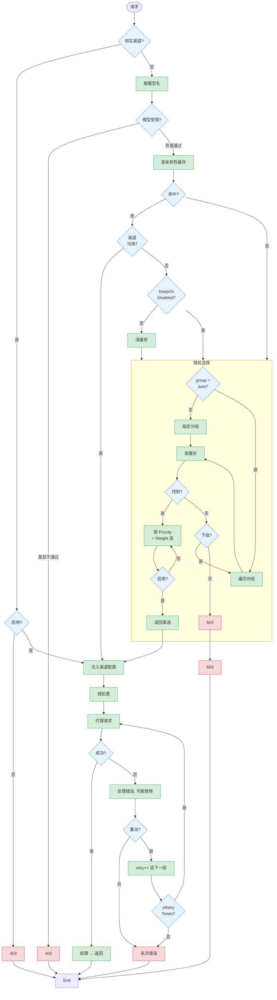

# 请求路由决策图

## 说明

Distribute 中间件决定每个请求走哪个渠道。决策顺序：Token 是否绑定特定渠道 → Channel Affinity 是否命中 → 按 Priority 加权随机选择 → 跨组降级。重试时逐级降低 Priority，同一组内所有 Priority 耗尽后切换到下一 Group。

## 关键决策点

| 步骤 | 决策 | 结果 |
|------|------|------|
| 1 | Token 绑定特定渠道？ | 是 → 直接使用该渠道，跳过所有选择逻辑 |
| 2 | Channel Affinity 命中且渠道可用？ | 是 → 复用上次的渠道 |
| 3 | Group = "auto"？ | 是 → 遍历用户的自动分组列表 |
| 4 | retry=0 的 Priority 层有空渠道？ | 否 → retry++ 选更低 Priority |
| 5 | 当前 Group 所有 Priority 用尽？ | 是 → 切换下一个 Group（仅 auto group） |
| 6 | 代理请求失败，错误可重试？ | 是 → retry++ 重新选渠道（下一层） |
| 7 | 错误匹配禁用规则？ | 是 → 异步禁用渠道，从缓存移除 |

## 重试决策矩阵

| 条件 | 是否重试 | 原因 |
|------|----------|------|
| 渠道级错误（IsChannelError） | ✅ 总是 | 换一个渠道可能成功 |
| 状态码 2xx | ❌ 不 | 请求已成功 |
| 状态码 4xx（除 408/429） | ❌ 不 | 一般是客户端问题 |
| 状态码 429（限流） | ✅ 重试 | 可能其他渠道不限流 |
| 状态码 5xx（除 504/524） | ✅ 重试 | 上游临时故障 |
| 状态码 504/524（超时） | ❌ 不 | 超时重试大概率还是超时 |
| ErrorCodeBadResponseBody | ❌ 不 | 响应解析失败，重试也一样 |
| Token 绑定了特定渠道 | ❌ 不 | 只有一条路，重试也是它 |
| ChannelAffinity 配置了 SkipRetry | ❌ 不 | 规则指定的 |
