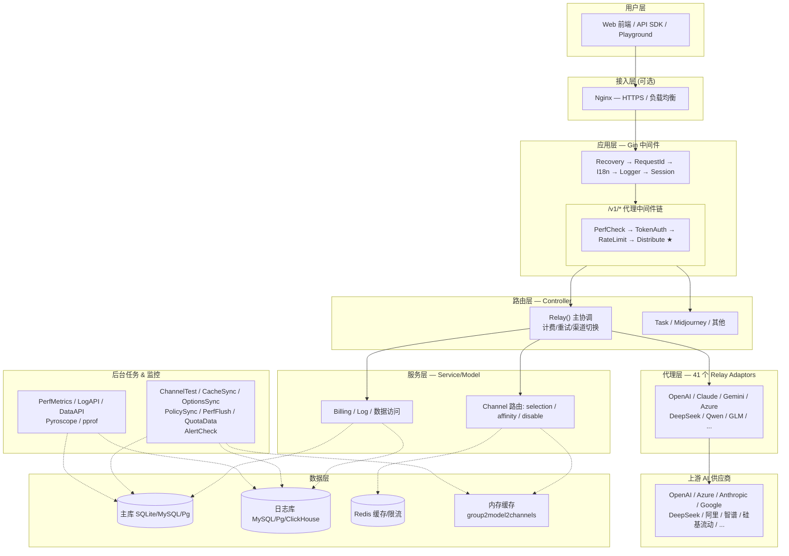

# 平台架构图

## 说明

用户请求（Web/API）通过 Nginx（可选）进入 Gin HTTP 服务。经过中间件链处理后，由 Distribute 中间件选择渠道，Controller 协调计费与重试，Relay Adaptor 转换协议并转发到上游 AI 供应商。监控数据（perf_metrics、logs）异步写入数据库。

数据流方向：**用户 → 接入层 → 应用层(Middleware) → 路由层(Distribute) → 代理层(Relay) → 上游供应商**

## 请求链路文字说明

1. 用户通过 Web 管理界面或 API 调用（cURL/SDK）发送请求
2. 可选经过 Nginx 反向代理（HTTPS 终端、负载均衡）
3. Gin 中间件链依次处理：panic 恢复 → 注入 request-id → 国际化 → 请求日志 → Session
4. 代理路径（`/v1/*`）经过鉴权（TokenAuth）→ 限流（ModelRequestRateLimit）→ **渠道选择（Distribute）**
5. Distribute 读取内存缓存 `group2model2channels`，按 Priority + Weight 选渠道，注入渠道配置到 Context
6. Controller.Relay() 预扣费后进入重试循环，调用对应 Provider Adaptor 转换请求并转发到上游
7. 成功 → 结算计费、记录 consume log、写入亲和性缓存
8. 失败 → 判断是否禁止渠道 → 判断是否重试（切换下一优先级渠道）
9. 后台周期性任务：同步渠道缓存/配置/权限策略，渠道自动测试与恢复，性能指标落盘，用量数据聚合
